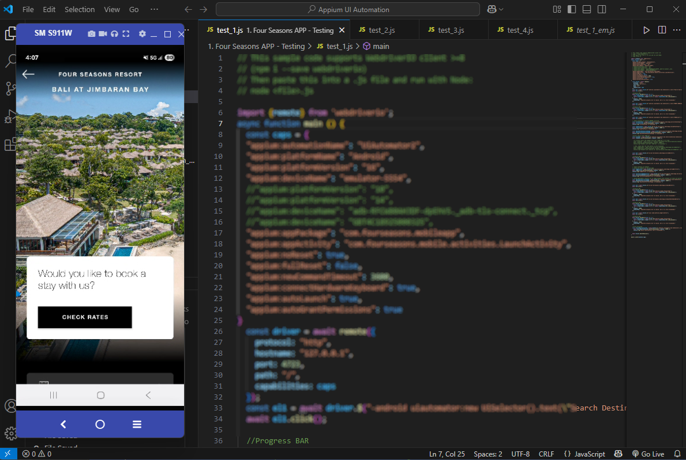

  <h1>UI Automation Testing – FourSeasons Mobile App</h1>

  
  
<em>End-to-end UI automation suite for the FourSeasons hotel booking app, crafted with Appium and WebdriverIO.</em>

---

## 📖 Overview

This project demonstrates a comprehensive UI automation suite for the **FourSeasons** Android application ("com.fourseasons.#########"). Leveraging **Appium Inspector** for element discovery and the **WebdriverIO v8** client, tests validate critical user journeys across emulators and real devices.

**Goals:**

* Ensure regression stability for core flows after each update.
* Provide clear, maintainable scripts with robust locator strategies.
* Generate actionable reports for QA and development teams.

---

## 🎥 Test Process Demo

A recorded walkthrough of the automation process highlights:

* Launching the FourSeasons app and navigating key screens
* Using Appium Inspector to identify elements and build selectors
* Executing search, selection, and booking validation flows
* Observing dynamic waits against progress bars and UI transitions

  <video width="800" controls>
    <source src="./videos/fourseasons_test_process.mp4" type="video/mp4">
    Your browser does not support the video tag.
  </video>

> **Note:** The video showcases the end-to-end test execution—no source code is exposed.

---

## 🛠️ Tech & Tools

* **Inspector:** Appium Inspector for element exploration and selector tuning
* **Framework:** Appium (UiAutomator2)
* **Client:** WebdriverIO v8 JavaScript bindings
* **Test Runner:** Mocha
* **Assertions & Reporting:** Chai + Allure Reports
* **Environment:** Android Emulator (API 30+) & Physical Devices (USB or Firebase Test Lab)
* **CI Integration:** Bitrise pipeline (config ready)

---

## 🔍 Automation Coverage

The suite automates these core scenarios:

* ✅ App launch and splash screen dismissal
* ✅ Search Destinations flow (e.g., NORTH AMERICA → ANGUILLA)
* ✅ Hotel listing selection and detail validation
* ✅ Booking action ("VIEW ALL" scroll & item tap)
* ✅ Back navigation and home return verification
* ✅ Dynamic wait handling for ProgressBar elements

---

## 🧩 Testing Approach

1. **Element Discovery:** Use Appium Inspector to locate accessibility IDs, resource IDs, and UIAutomator selectors.
2. **Robust Selectors:** Prefer accessibility IDs; fallback to UIAutomator scrollable selectors for deep content.
3. **Dynamic Waits:** Implement `waitUntil` for progress indicators and element visibility to avoid flakiness.
4. **Reusable Hooks:** Initialize/teardown sessions in `beforeEach` and `afterEach` hooks within Mocha.
5. **Reporting:** Capture screenshots on failure and generate Allure HTML with logs and video snippets.

---

## 🌐 Portfolio Showcase

This automation suite exemplifies my capability to integrate **Appium Inspector** and **WebdriverIO** for maintainable, scalable UI testing. It’s ready to be extended for additional scenarios and integrated into any CI/CD pipeline.

> **Note:** The underlying FourSeasons application is proprietary; this repo focuses solely on the test artifacts and execution recordings.

---

## 📝 License

MIT © Akmal Hameed
